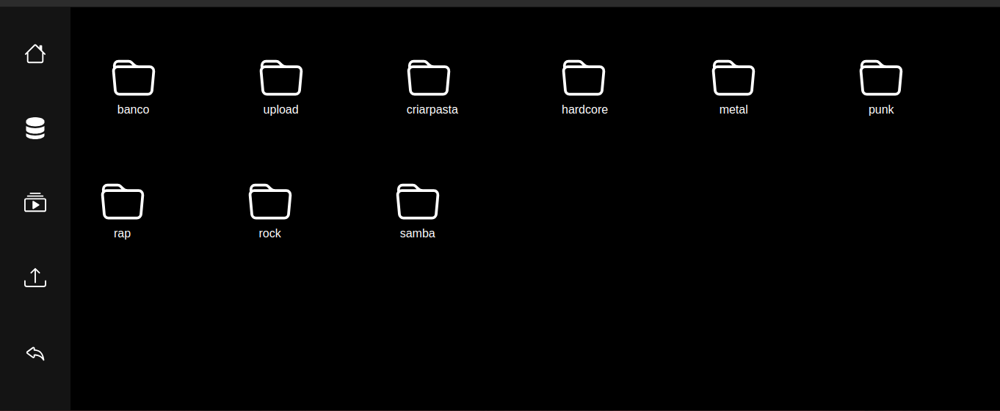

# Mymp3
Meu repositório online de musicas com sistema de playlists/pastas em PHP 
<a href="https://mymp3repositorio.000webhostapp.com/" targe="_blank">Link do projeto!</a>

<h1>❗❗❗Ao baixar exclua os aruivos <a href="https://github.com/andradedevweb/mymp3/blob/main/app/models/playlists_uploads/hardcore/deleteisso.txt" targe="_blank">deleisso.txt</a> dentro dos diretorios vazios na pasta <a href="https://github.com/andradedevweb/mymp3/tree/main/app/models/playlists_uploads" targe="_blank">playlists_uploads</a> ❗❗❗</h1>

## 🤔 Como o sistema funciona

No menu lateral você podera observar 5 ícones, o ícone home é um botão que leva para uma página onde pode você poderá ler uma breve descrição do projeto, abaixo deste está o banco de músicas onde todas as músicas upadas no projeto pela pagina de upload são renderizadas, abaixo deste teremos as playlists onde você terá playlists separadas por genero e poderá também criar suas proprisa playlist personalizada clicando no icone "criar pasta" e upando suas musicas, abaixo do mesmo temos a página responsável por realizar uploads das músicas para o projeto e por fim temos o botão para retornar a página de login

## 💻 Explicando o código

Basicamente a "magica" da aplicação gira entorno de uma função para escanear diretorios e exibir os arquivos contidos nos mesmos em paginas PHP, uma função que efetua upload de arquivos mp3 para dentro de um diretório (que posteriormente serão escaneados pela primeira função e exibidos em uma pagina PHP) e por fim uma função que ira criar um novo diretório (playlist) e uma pagina para exibir os aquivos e realizar uploads dos mesmos, com essas três funções nós temos uma aplicação dinamica que realiza upload de arquivos mp3, armazena, exibe os mesmos para o usuario e ainda os organiza em pastas.

## 📂 Explicando a estrutura

O sistema usa o padrão MVC orientado a objetos, caso não tenha familharidade com o padrão MVC você pode o entender como tendo 3 pastas principais responsaveis pelo projeto, a pasta <a href="https://github.com/andradedevweb/mymp3/tree/main/app/models" targe="_blank">models</a> é geralmente responsavel por armazenar os arquivos reponsaveis pela conexão dom a database, neste projeto a pasta models é responsavel por armazenar os arquivos de upados e a pasta <a href="https://github.com/andradedevweb/mymp3/tree/main/app/views" targe="_blank">views</a> é responsavel por armazenar os arquivos que serão exibidos para o usuario.

## 📋 Pré-requisitos

Se não puder acessar o <a href="https://mymp3repositorio.000webhostapp.com/" targe="_blank">link do projeto</a> recomendo fortemente que baixe o <a href="https://www.apachefriends.org/pt_br/index.html" targe="_blank">Xampp</a>  e insara os arquivos do projeto na pasta htdocs, ou baixe um servidor local com PHP 5 ou superior e execute, você podera acessar o projeto em <a href="http://localhost/" targe="_blank">localhost</a> no seu computador.

## ⚙️ Executando os testes

Caso queira testar o upload de arquivos eu deixei um arquivo mp3 nos arquivos do projeto: <a href="https://github.com/andradedevweb/mymp3/blob/main/audio.mp3">clique aqui para acessar</a>

Você pode ir na pagina de playlists e testar o sistema de criação de playlists/pastas, inserir musicas nas playlists/banco de musicas ou simplesmente ouvir as as musicas já incluidas no sistema.

## 🛠️ Construído com

* [PHP](https://www.php.net/) - Linguagem usada
* [Bootstrap]([https://www.php.net/](https://getbootstrap.com/)) - Framework frontend usado
* [Xampp](https://www.apachefriends.org/pt_br/index.html) - Servidor local usada para teste
* [VsCode](https://code.visualstudio.com/) - Editor de código usado
